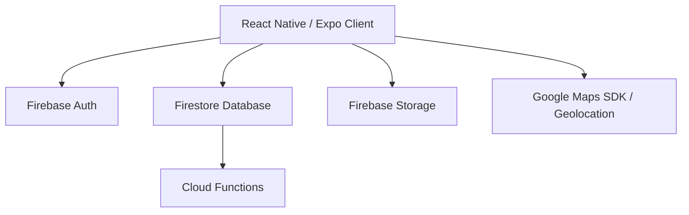
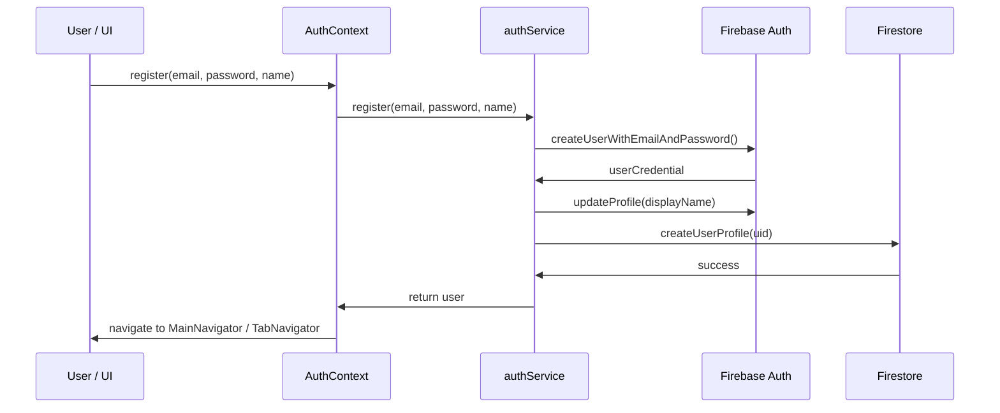
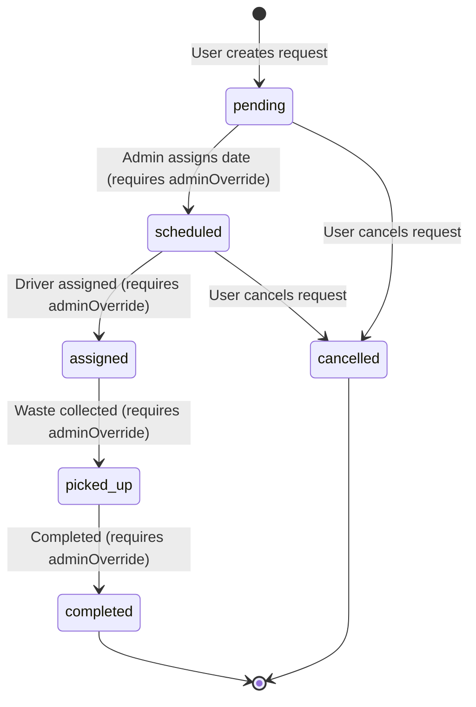

# Member 1 Release Handoff

* **Project**: EcoSnap & Segregate
* **Member**: Member 1 / Pravee
* **Responsibilities**: Firebase, Authentication, Firestore, Storage, Cloud Functions, Waste History, Pickup Requests, Community Reports, Reviews & Ratings, Notifications, Reminders, Google Maps, Geolocation, Recycling Facilities, Security, Deployment.

---

## 1. Architecture

The application is structured into a React Native (Expo) client and a Firebase serverless backend:



* **Client**: Encapsulates user interactions, scanning, maps mapping, and local notification scheduling.
* **Services Layer**: Decouples UI screens from business logic. Services are defined under `mobile-app/src/services/`.
* **Database/Storage**: Uses Firestore for real-time relational-like data structures and Cloud Storage for media assets.

---

## 2. Firebase Configuration

Firebase is initialized as a singleton inside [firebaseConfig.ts](file:///c:/Users/Lenovo/OneDrive/Desktop/Pravee/EcoSnap/mobile-app/src/services/firebase/firebaseConfig.ts). All configuration parameters are loaded dynamically from environment variables:
* `EXPO_PUBLIC_FIREBASE_API_KEY`
* `EXPO_PUBLIC_FIREBASE_AUTH_DOMAIN`
* `EXPO_PUBLIC_FIREBASE_PROJECT_ID`
* `EXPO_PUBLIC_FIREBASE_STORAGE_BUCKET`
* `EXPO_PUBLIC_FIREBASE_MESSAGING_SENDER_ID`
* `EXPO_PUBLIC_FIREBASE_APP_ID`

---

## 3. Authentication Flow

Authentication uses Firebase Authentication and is managed by [authService.ts](file:///c:/Users/Lenovo/OneDrive/Desktop/Pravee/EcoSnap/mobile-app/src/services/firebase/authService.ts) and [AuthContext.tsx](file:///c:/Users/Lenovo/OneDrive/Desktop/Pravee/EcoSnap/mobile-app/src/context/AuthContext.tsx):



* **State Persistence**: Handles session management and state restoration automatically.
* **Navigators**: Controlled via `useAuth()` state hook. If `user` exists, mounts `TabNavigator`; otherwise, mounts `AuthNavigator`.

---

## 4. Firestore Collections

Firestore structures data hierarchically using subcollections to enforce strict user ownership:

* `/users/{userId}`: Contains user profile documents (score, joinedDate, language).
  * `/users/{userId}/wasteRecords/{recordId}`: Waste scans data (category, confidence, disposal method).
  * `/users/{userId}/pickupRequests/{requestId}`: Pickup orders (address, scheduled time, status).
  * `/users/{userId}/communityReports/{reportId}`: Reported illegal dumps/bins.
  * `/users/{userId}/notifications/{notificationId}`: Notification messages history.
  * `/users/{userId}/notificationPreferences/{settingsDoc}`: Custom preferences settings.
  * `/users/{userId}/devices/{deviceId}`: Registered push tokens.
* `/facilities/{facilityId}`: Public recycling facilities.
  * `/facilities/{facilityId}/reviews/{reviewId}`: User-submitted facility ratings and comments.

---

## 5. Storage Structure

Firebase Storage uses files organized under private paths matching user ownership rules:
* Profile avatars: `users/{uid}/profile/{filename}`
* Scanned waste images: `users/{uid}/waste/{recordId}/{filename}`
* Community report photos: `users/{uid}/reports/{reportId}/{filename}`

---

## 6. Pickup Workflow

Pickup requests follow a standard status lifecycle transition enforced in the rules and repo layers:



* Rules restrict ordinary client users from executing transitions other than `pending -> cancelled` or `scheduled -> cancelled`.

---

## 7. Community Workflow

Community reporting allows reporting illegal dump sites, full bins, etc.
* **Validation**: Coordinates are validated before saving (Latitude `[-90, 90]`, Longitude `[-180, 180]`).
* **Lifecycle**: Starts in `pending`. Can transition through `under_review`, `verified`, `resolved`, or `rejected` only via Admin operations.
* **Exclusion**: No sensitive user fields are exposed in public listings.

---

## 8. Maps & Geolocation Workflow

Provides geographic operations inside [LocationService.ts](file:///c:/Users/Lenovo/OneDrive/Desktop/Pravee/EcoSnap/mobile-app/src/services/location/LocationService.ts) and [mapsService.ts](file:///c:/Users/Lenovo/OneDrive/Desktop/Pravee/EcoSnap/mobile-app/src/services/location/mapsService.ts):
* Request geolocation permissions. Fallback to cached location if denied.
* Calculate distance in meters using Haversine formula.
* Launch platform-specific maps application with destination coordinates (Apple Maps on iOS, Google Maps on Android).

---

## 9. Facility Workflow

Handles recycling facility searching and discovery:
* **Filtering**: Facilities can be filtered by type (Recycling Center, E-Waste Facility, Donation Center) and material.
* **Proximity search**: Uses coordinates bounds to return nearest centers within a search radius.

---

## 10. Reviews/ratings Workflow

Managed inside [reviewRepository.ts](file:///c:/Users/Lenovo/OneDrive/Desktop/Pravee/EcoSnap/mobile-app/src/services/firebase/reviewRepository.ts):
* Users can submit one review per facility.
* Ratings must be integers between 1 and 5. Comments are validated to be <= 500 characters.
* Real-time aggregation calculates average ratings and counts.

---

## 11. Notifications Workflow

Managed in [notificationRepository.ts](file:///c:/Users/Lenovo/OneDrive/Desktop/Pravee/EcoSnap/mobile-app/src/services/firebase/notificationRepository.ts):
* Register and unregister Expo push tokens.
* Event triggers dispatch notifications when pickup requests are scheduled or community reports are verified.
* Payloads are sanitized and exclude passwords, API keys, or precise user coordinates.

---

## 12. Security Rules

* **Firestore Rules**: Block top-level collection access. Limit CRUD operations on subcollections to authenticated owners. Use `.diff()` controls to prevent users from altering metadata (e.g. `createdAt`, `joinedDate`, `score`) or status structures without permission.
* **Storage Rules**: Validate mime types (`image/.*`), limit files size (5MB for avatar, 10MB for reports/waste), and block deletes/writes for non-owners.

---

## 13. Environment Variables

Provide the following configurations in your local `.env` file:
```bash
EXPO_PUBLIC_FIREBASE_API_KEY=your_api_key_here
EXPO_PUBLIC_FIREBASE_AUTH_DOMAIN=your_auth_domain_here
EXPO_PUBLIC_FIREBASE_PROJECT_ID=your_project_id_here
EXPO_PUBLIC_FIREBASE_STORAGE_BUCKET=your_storage_bucket_here
EXPO_PUBLIC_FIREBASE_MESSAGING_SENDER_ID=your_messaging_sender_id_here
EXPO_PUBLIC_FIREBASE_APP_ID=your_app_id_here
EXPO_PUBLIC_GOOGLE_MAPS_API_KEY=your_maps_key_here
```

---

## 14. Deployment Steps

1. Configure `.firebaserc` with your dev/prod projects.
2. Build Cloud Functions using: `npm --prefix backend/cloud-functions run build`.
3. Deploy Firestore rules/indexes and Storage rules:
   ```bash
   firebase deploy --only firestore:rules,firestore:indexes,storage:rules
   ```
4. Deploy Cloud Functions:
   ```bash
   firebase deploy --only functions
   ```
5. Trigger EAS builds:
   ```bash
   eas build --platform all --profile production
   ```

---

## 15. Testing Commands

Execute verification checks from the `mobile-app` directory:
```bash
# Type checking
npm run ts:check

# Unit and integration tests
npm run test

# Project health diagnostic
npx expo-doctor
```

---

## 16. Known Limitations

* Geolocation permissions fallback returns null if denied, disabling distance sorting.
* Expo push notifications require physical devices; simulator push triggers are not supported natively without emulator credentials.
* Test suite relies on an in-memory database wrapper mocking Firestore interfaces; end-to-end integration requires running the Firebase Emulator.

---

## 17. Production Checklist

* [x] Firebase configured
* [x] Authentication verified
* [x] Firestore rules verified
* [x] Storage rules verified
* [x] Firestore indexes verified
* [x] Cloud Functions reviewed
* [x] Pickup flow verified
* [x] Community flow verified
* [x] Maps verified
* [x] Facilities verified
* [x] Reviews verified
* [x] Notifications verified
* [x] Secrets audited
* [x] TypeScript passes
* [x] Tests pass
* [x] Expo Doctor passes
* [x] Production configuration reviewed
* [x] Documentation complete

---

## 18. Handoff Notes

All Member 1 core features are fully completed, tested, and ready.
Member 2's components (TensorFlow Lite, Camera, AI detection, Sustainability Intelligence, analytics, environmental impact, sustainability assistant, eco points, badges, challenges, and QR/Barcode scan) are integrated correctly at the interface level and are left completely untouched in their implementation.
The codebase is validated and ready for next development stages.
