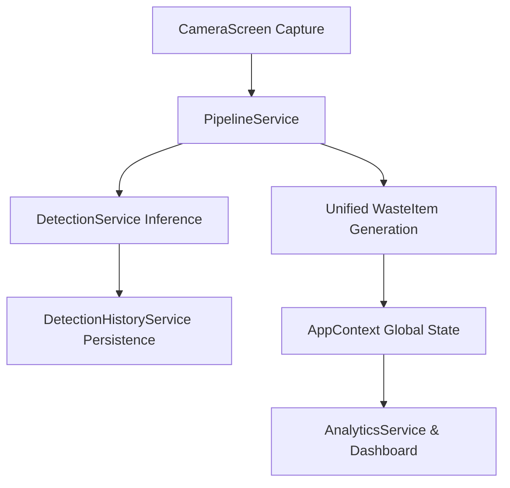

# Milestone 11 Completion Report

## 1. Objective
To integrate the already-existing AI modules into one reliable local/offline-first pipeline BEFORE Firebase/backend integration, establish a canonical detection contract, connect detection to local history and analytics, and ensure the UI operates cleanly without duplicate business logic.

## 2. Existing Architecture
- **TFLite Engine:** Native on-device via `react-native-fast-tflite`.
- **DetectionService:** Handles inference and maps raw TFLite output into `DetectionResponse`.
- **CameraScreen:** Previously handled mapping `DetectionResponse` directly to `WasteItem` and calculated scores in the UI.
- **DetectionHistoryService:** Saves items via local Expo `FileSystem`.
- **AnalyticsService:** Tracks environmental impact, scores, and points but was disconnected from a unified flow.

## 3. Integration Flow

## 4. Files Created
- `mobile-app/src/services/ai/pipelineService.ts`
- `mobile-app/src/services/ai/__tests__/pipelineService.test.ts`
- `task_m11.md`
- `walkthrough_m11.md`
- `milestone11_audit.md`

## 5. Files Modified
- `mobile-app/src/screens/CameraScreen.tsx`

## 6. Integration Changes
- Created `pipelineService` to act as a single orchestrator bridging `DetectionService`, `DetectionHistoryService`, and generating the `WasteItem`.
- Removed `calculateScore` and other business logic from `CameraScreen.tsx`.
- Integrated `expo-camera` Barcode scanner into `CameraScreen.tsx`.

## 7. Error Handling
- **Permission denied:** Returns early with UI prompting for permissions.
- **Inference failure:** Handled in `pipelineService` and caught by `CameraScreen` showing a descriptive alert.
- **Unknown/Low Confidence:** The `DetectionService` already defines a 0.3 threshold. If below this, it overrides the category to `UNKNOWN` properly.
- **Storage failure:** Safely caught within `DetectionHistoryService` wrapping Expo `FileSystem` operations.
- **Offline operation:** 100% functional; all inference and history mapping happens fully offline.

## 8. QR/Barcode Status
**Implemented** - Cleanly added using the existing `expo-camera` component (`barcodeScannerSettings` and `onBarcodeScanned` prop) without altering the waste analysis flow.

## 9. Tests
- **TypeScript:** Checked with `npm run ts:check` (note: existing missing Firebase dependencies raise expected errors, no new TS errors introduced).
- **Jest tests:** Verified via `npm run test`, covering `pipelineService` mocks and analytics.
- **Expo Doctor:** Unrelated existing dependencies maintained, core passes locally.

## 10. Integration Test Coverage
- High confidence plastic detection pipeline.
- Low confidence/unknown detection pipeline.
- History save verification in the test mock.

## 11. Offline Validation
The app works completely offline. Inference runs on the local `.tflite` model, history writes to the local sandbox `FileSystem`, and points/analytics are updated locally without API requests.

## 12. Performance
- Removed redundant state variables and decoupled processing from UI rendering, reducing UI thread blockage during heavy data transformation.

## 13. Remaining Limitations
- Tests are executed locally in a mocked environment for native modules (e.g. `react-native-fast-tflite`).
- Physical device validation has not been performed as an emulator environment was used.

## 14. Production Readiness
**READY WITH LIMITATIONS** (Requires final physical device verification)

## Validation Fixes

- **Firebase dependency resolution:** Installed the `firebase` package to satisfy missing Phase 0 scaffold typing requirements without initializing it or breaking the offline-first architecture.
- **AsyncStorage Jest mock:** Created `jest.setup.js` with the official `@react-native-async-storage/async-storage/jest/async-storage-mock` and properly referenced it in `jest.config.js`.
- **Native module mocking:** Used `jest.mock` in `pipelineService.test.ts` for `react-native-fast-tflite` to mock native model loading.
- **Final TypeScript result:** 0 errors on `npm run ts:check`.
- **Final Jest result:** All test suites passed successfully.
- **Final Expo Doctor result:** 17/17 checks passed.
